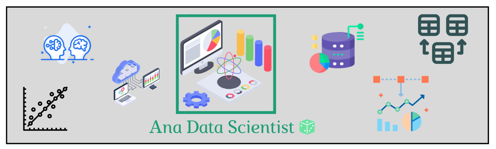

[![Github][gitHub-shield]][gitHub-url]
[![LinkedIn][linkedin-shield]][linkedin-url]
[![Gmail][gmail-shield]][gmail-url]
[![MIT License][license-shield]][license-url]

# Prevendo Preço de Casa 

<!-- TABLE OF CONTENTS -->

 
<h3>Sumário</h3>

  <ol>
    <li>
      <a href="#about-the-project">About The Project</a>
      <ul>
        <li><a href="#built-with">Built With</a></li>
      </ul>
    </li>
    <li>
      <a href="#getting-started">Getting Started</a>
      <ul>
        <li><a href="#prerequisites">Prerequisites</a></li>
        <li><a href="#installation">Installation</a></li>
      </ul>
    </li>
    <li><a href="#usage">Usage</a></li>
    <li><a href="#roadmap">Roadmap</a></li>
    <li><a href="#contributing">Contributing</a></li>
    <li><a href="#license">License</a></li>
    <li><a href="#contact">Contact</a></li>
    <li><a href="#acknowledgments">Acknowledgments</a></li>
  </ol>

## Descrição/Objetivo do Projeto
 
 O objetivo desse projeto é prever o preço de casa baseada nas suas características utilizando técnica de ciência de dados e machine learning. 

 Os dados utilizados para o desenvolvimento desse projeto é de uma competição da plataforma [Kaggle](https://www.kaggle.com/competitions/house-prices-advanced-regression-techniques). 

(<a href="#readme-top">Voltar para o início</a>)

## Métados Usados

(<a href="#readme-top">Voltar para o início</a>)

## Tecnologias

(<a href="#readme-top">Voltar para o início</a>)

## Contato

Email -
Link do Projeto - 
Sinta-se à vontade para entrar em contato com os líderes da equipe com qualquer dúvida ou se estiver interessado em contribuir!

(<a href="#readme-top">Voltar para o início</a>)

## Referências

(<a href="#readme-top">Voltar para o início</a>)

[gitHub-shield]: https://img.shields.io/badge/github-%23121011.svg?style=for-the-badge&logo=github&logoColor=white
[gitHub-url]: https://github.com/anamariapego/

[linkedin-shield]: https://img.shields.io/badge/linkedin-%230077B5.svg?style=for-the-badge&logo=linkedin&logoColor=white
[linkedin-url]: https://www.linkedin.com/in/ana-pego/

[gmail-shield]: https://img.shields.io/badge/Gmail-D14836?style=for-the-badge&logo=gmail&logoColor=white
[gmail-url]: anapinheiro0404@gmail.com

[license-shield]: https://img.shields.io/github/license/anamariapego/House_Price_Predicition.svg?style=for-the-badge
[license-url]: https://github.com/anamariapego/House_Price_Predicition/blob/main/LICENSE
